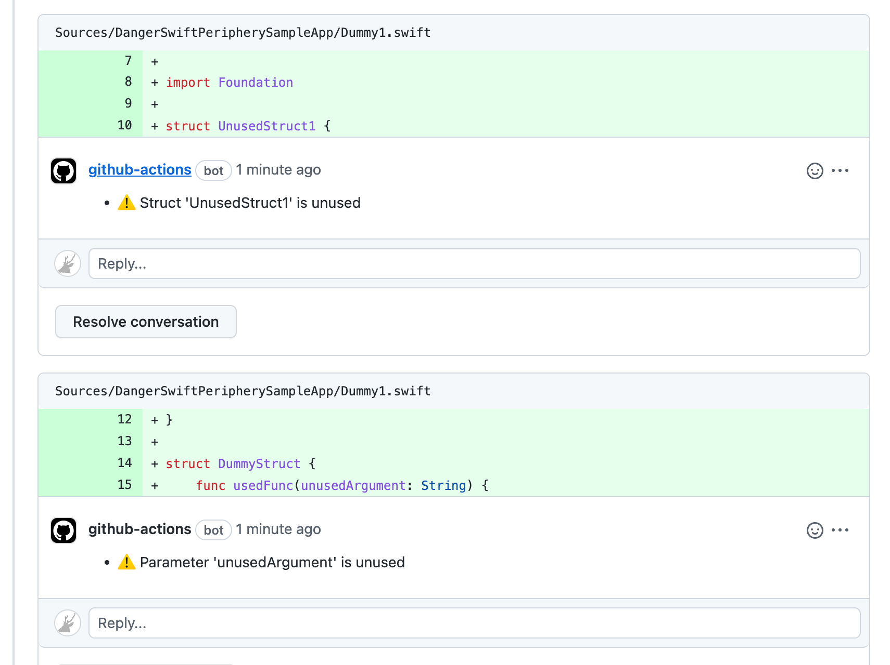

# DangerSwiftPeriphery

[Danger Swift](https://github.com/danger/swift) plugin to run [Periphery](https://github.com/peripheryapp/periphery) on CI.


[](https://github.com/taji-taji/DangerSwiftPeriphery/blob/main/LICENSE)
[](https://github.com/taji-taji/DangerSwiftPeriphery/releases/latest)
[](https://swiftpackageindex.com/taji-taji/DangerSwiftPeriphery)
[](https://swiftpackageindex.com/taji-taji/DangerSwiftPeriphery)

## Features

This plugin will comment unreferenced code detected by periphery via Danger Swift.



## Requirements

- Swift 5.8 or later

## Usage

### Preparation

- [Danger Swift](https://github.com/danger/swift) Setup.

### Package.swift

1. Add DangerSwiftPeriphery to your `Package.swift`  dependencies:

    ```swift
    .package(url: "https://github.com/taji-taji/DangerSwiftPeriphery.git", from: "1.0.0")
    ```

2. Add DangerSwiftPeriphery to your dependencies of `DangerDependencies` target:

    ```swift
    .product(name: "DangerSwiftPeriphery", package: "DangerSwiftPeriphery")
    ```

The following is an example of `Package.swift` in its entirety.

```swift
let package = Package(
    // ...
    dependencies: [
        // Danger
        .package(url: "https://github.com/danger/swift.git", from: "3.0.0"), // dev
        // Danger Plugins
        // 1. Add DangerSwiftPeriphery to your `Package.swift`  dependencies:
        .package(url: "https://github.com/taji-taji/DangerSwiftPeriphery.git", from: "1.0.0"), // dev
    ],
    targets: [
        // ...
        // Add DangerSwiftPeriphery to dependencies in DangerDependencies.
        .target(name: "DangerDependencies",
                dependencies: [
                    .product(name: "Danger", package: "swift"),
                    // 2. Add DangerSwiftPeriphery to your dependencies of `DangerDependencies` target:
                    .product(name: "DangerSwiftPeriphery", package: "DangerSwiftPeriphery"), 
                ]),
        // ...
    ]
)
```


### Dangerfile.swift

#### Set scan options

If you have a `.periphery.yml` file, simply include the following in `Dangerfile.swift`

```swift
import Danger
import DangerSwiftPeriphery

DangerPeriphery.scan()
```

Alternatively, periphery options can be passed as arguments.

```swift
import Danger
import DangerSwiftPeriphery

DangerPeriphery.scan(arguments: [
    "--workspace MaApp.xcworkspace",
    "--schemes MyApp",
    "--index-store-path /path/to/index/store",
    "--skip-build"
])

// or use PeripheryScanOptions enum as array
DangerPeriphery.scan(arguments: [
    PeripheryScanOptions.workspace("MaApp.xcworkspace"),
    PeripheryScanOptions.schemes(["MyApp"]),
    PeripheryScanOptions.indexStorePath("/path/to/index/store"),
    PeripheryScanOptions.skipBuild
])

// or use PeripheryScanOptions enum with resultBuilder
DangerPeriphery.scan {
    PeripheryScanOptions.workspace("MaApp.xcworkspace")
    PeripheryScanOptions.schemes(["MyApp"])
    PeripheryScanOptions.indexStorePath("/path/to/index/store")
    PeripheryScanOptions.skipBuild
}

// All three scan methods above behave the same.
```

In the future, if a new option is added to Periphery, and it is undefined in this plugin, you can use `.custom`.
For example, if a new version of Periphery adds an option `--new-option` that is undefined in `PeripheryScanOptions` of this plugin, you can use `PeripheryScanOptions.custom("--new-option foo")` to use `--new-option`.

#### Handle scan result manually

By setting the `shouldComment` option to false, this plugin will not comment on the target pull request.  
You can manually handle the scan results by setting this option to false and using the return value of the scan method.

```swift
import Danger
import DangerSwiftPeriphery

let result = DangerPeriphery.scan(shouldComment: false)

// handle scan result manually
switch result {
case let .success(violations):
    // handle scan violations
    for violation in violations {
        warn(message: violation.message,
             file: violation.filePath,
             line: violation.line)
    }
case let .failure(error):
    // handle scan error
    fail(error.localizedDescription)
}
```

#### Specify periphery executable

You may also specify the location of periphery binaries.

```swift
import DangerSwiftPeriphery

DangerPeriphery.scan(peripheryExecutable: "/path/to/periphery")
```

### Debug print

The option for Debug can be used to output debugging information.
This can be done in one of the following ways.

1. `verbose` argument
    - Set the `verbose` argument of the scan method to true. (Default: false)
    ```swift
    // in Dangerfile.swift
    DangerPeriphery.scan(verbose: true)
    ```

2. `DANGER_SWIFT_PERIPHERY_DEBUG` environment variables
    - Set `DANGER_SWIFT_PERIPHERY_DEBUG=1` in the environment where danger-swift is run.
This environment variable overrides the value of the `verbose` argument described above.

